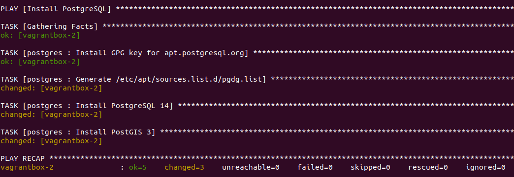

# Déploiement de GeoStack avec ansible

## Description

Illustration du déploiement de GeoServer et PostgreSQL avec Ansible.

## L'inventaire ansible

Nous avons ici un seul inventaire [inventory/vagrantbox](inventory/vagrantbox/README.md). En situation réelle, nous aurions plutôt `inventory/geostack_qlf` et `inventory/geostack_prod`.

## Les playbooks

### Déploiement de PostgreSQL

Le déploiement est réalisé à l'aide du playbook [postgres.yml](postgres.yml) comme suit :

```bash
ansible-playbook -i inventory/vagrantbox postgres.yml
```

Nous observons le résultat suivant :



Le fichier [roles/postgres/README.md](roles/postgres/README.md) explique le fonctionnement du rôle utilisé par ce playbook.

Nous pouvons tester ainsi :

```bash
# se connecter à la machine
ssh vagrant@vagrantbox-2
# switcher sur l'utilisateur postgres
sudo su postgres
# créer une base "gis"
createdb gis
# ajouter l'extension postgis
psql -d gis -c "CREATE EXTENSION postgis"
```

Nous noterons que nous pourrions aussi utiliser un module [Community.Postgresql](https://docs.ansible.com/ansible/latest/collections/community/postgresql/index.html#plugin-index) d'ansible pour créer cette base.

### [geoserver.yml](geoserver.yml)

Le déploiement est réalisé à l'aide de la commande suivante :

```bash
ansible-playbook -i inventory/vagrantbox geoserver.yml
```

Le fichier [roles/geoserver](roles/geoserver/README.md) explique le fonctionnement du rôle utilisé par ce playbook.


Nous pouvons tester en accédant à http://vagrantbox-1:8080/geoserver/ (admin/geoserver) et en vérifiant l'état du service geoserver :

```bash
# se connecter à la machine
ssh vagrant@vagrantbox-1
# vérifier que le service est "active (running)"
sudo service geoserver status
# inspecter au besoin les logs
sudo journalctl -u geoserver -f
```

## Ressources

* [docs.ansible.com - Best Practices - Alternative Directory Layout](https://docs.ansible.com/ansible/2.9/user_guide/playbooks_best_practices.html#alternative-directory-layout) utilisé pour structurer

