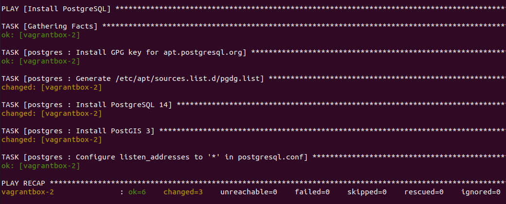

# Déploiement de GeoStack avec ansible

Illustration du déploiement de GeoServer et PostgreSQL avec Ansible.

## L'inventaire ansible

Nous avons ici un seul inventaire [inventory/vagrantbox/hosts](inventory/vagrantbox/hosts) avec un fichier [inventory/vagrantbox/README.md](inventory/vagrantbox/README.md) expliquant comment créer les machines avec vagrant. En situation réelle, nous aurions plutôt :

* Un inventaire pour l'environnement de QUALIF (ex: `inventory/geostack_qlf`)
* Un inventaire pour l'environnement de PRODUCTION (ex : `inventory/geostack_prd`)

## Les playbooks ansible

Les deux principaux playbooks sont les suivants :

* [playbooks/postgres.yml - Le playbook postgres.yml pour le déploiement de PostgreSQL](postgres.md)
* [playbooks/geoserver.yml - Le playbook geoserver.yml pour le déploiement de GeoServer](geoserver.md)

En complément, nous trouverons :

* [playbooks/postgres-db - Création d'une base de données PostgreSQL](postgres-db.md)


## Déploiement de PostgreSQL

Le déploiement est réalisé à l'aide du playbook [playbooks/postgres.yml](playbooks/postgres.yml) comme suit :

```bash
ansible-playbook -i inventory/vagrantbox playbooks/postgres.yml
```

Nous observerons le résultat suivant :


Nous noterons que [playbooks/postgres.yml](playbooks/postgres.yml) fait appel à un seul [roles/postgres](roles/postgres/README.md) dont le fonctionnement est détaillé.


## Déploiement de GeoServer

Le déploiement est réalisé à l'aide du playbook [playbooks/geoserver.yml](playbooks/geoserver.yml) comme suit :

```bash
ansible-playbook -i inventory/vagrantbox playbooks/geoserver.yml
```

Nous observerons le résultat suivant :



Nous pourrons tester en accédant à http://vagrantbox-1:8080/geoserver/ (admin/geoserver) et en vérifiant l'état du service systemd geoserver :

```bash
# se connecter à la machine
ssh vagrant@vagrantbox-1
# vérifier que le service est "active (running)"
sudo service geoserver status
# inspecter au besoin les logs
sudo journalctl -u geoserver -f
```

Nous noterons que [playbooks/geoserver.yml](playbooks/geoserver.yml) fait appel à un seul [roles/geoserver](roles/geoserver/README.md) dont le fonctionnement est détaillé.


## Création d'un utilisateur et base de données PostgreSQL

Nous pourrions ensuite appliquer une [procédure de création d'un utilisateur et d'une base de données PostgreSQL](docs/create-db.md).

Nous pouvons aussi nous appuyer sur les modules [ansible Community.Postgresql](https://docs.ansible.com/ansible/latest/collections/community/postgresql/index.html#plugin-index) pour porter cette procédure sous forme d'un [playbooks/create-db.yml](playbooks/create-db.yml).


## Ressources

* [docs.ansible.com - Best Practices - Alternative Directory Layout](https://docs.ansible.com/ansible/2.9/user_guide/playbooks_best_practices.html#alternative-directory-layout) est utilisé pour structurer le playbooks

