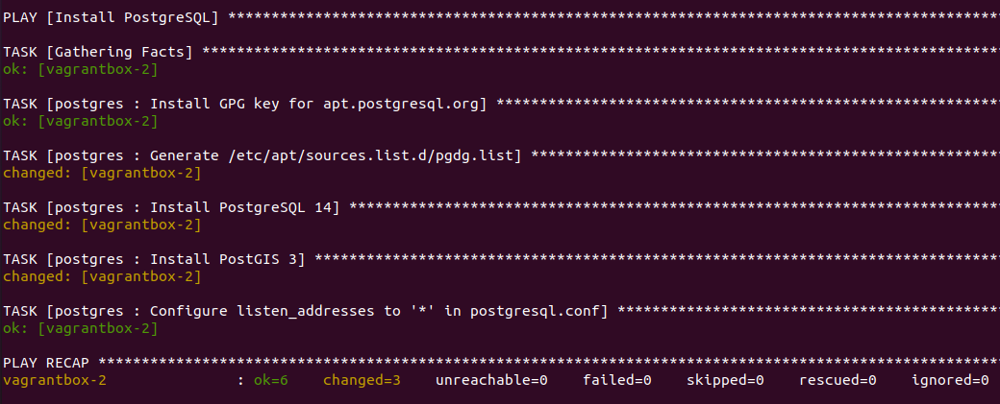

# Le playbook geoserver.yml pour le déploiement de GeoServer

## Utilisation

Le déploiement est réalisé à l'aide du playbook [geoserver.yml](geoserver.yml) comme suit :

```bash
ansible-playbook -i inventory/vagrantbox geoserver.yml
```

Nous observons le résultat suivant :



Nous pouvons tester en accédant à http://vagrantbox-1:8080/geoserver/ (admin/geoserver) et en vérifiant l'état du service systemd geoserver :

```bash
# se connecter à la machine
ssh vagrant@vagrantbox-1
# vérifier que le service est "active (running)"
sudo service geoserver status
# inspecter au besoin les logs
sudo journalctl -u geoserver -f
```

## Détail du fonctionnement

Nous notons que le playbook fait appel à un seul rôle `geoserver`. Le fichier [roles/geoserver/README.md](roles/geoserver/README.md) explique son fonctionnement.
