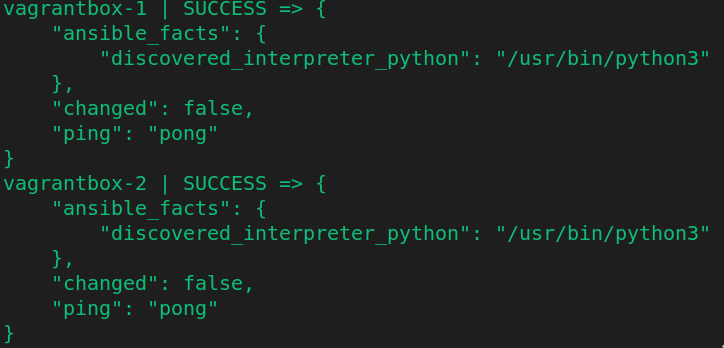

# Inventaire vagrantbox

## Principe

Le dépôt [mborne/vagrantbox](https://github.com/mborne/vagrantbox) contient un fichier [Vagrantfile](https://github.com/mborne/vagrantbox/blob/master/Vagrantfile) permettant de créer des VM avec Vagrant et VirtualBox.

Le fichier [hosts](hosts) énumère ces machines en les assignant à des groupes `geoserver` et `postgres`.

## Création des machines

```bash
git clone https://github.com/mborne/vagrantbox
cd vagrantbox
# création des machines
vagrant up
# pour éviter des problèmes SSH en cas de récréation
ansible-playbook -i inventory clear-ssh.yml
# pour configurer la clé SSH de l'utilisateur courant
ansible-playbook -i inventory configure-vm.yml
```

## Test de l'accès aux machines

```bash
ansible -i inventory/vagrantbox all -m ping
```


