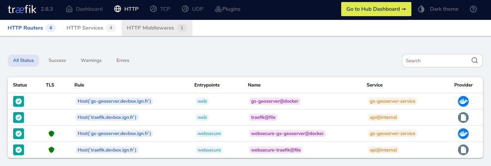

# Déploiement de GeoStack avec docker compose

Illustration de l'utilisation de docker compose pour démarrer une stack applicative à partir d'un fichier [docker-compose.yml](docker-compose.yml) s'appuyant sur :

* L'image officielle [postgis/postgis](https://hub.docker.com/r/postgis/postgis) pour le déploiement PostgreSQL
* L'image [mborne/docker-geoserver](https://github.com/mborne/docker-geoserver#readme) construite avec GitHub actions.


## Utilisation

* Démarrer la stack :

```bash
# export POSTGRES_PASSWORD=MotDePasse
docker compose up -d
```


* Vérifier que les services sont bien démarrés : `docker compose ps`


* Accéder à GeoServer sur le port 8082 :
  * http://localhost:8082/geoserver
  * http://devbox.ign.fr:8082/geoserver/

## Utilisation de traefik

Nous remarquerons les labels suffisant pour l'exposition avec [traefik](https://doc.traefik.io/traefik/) ainsi que la possibilité de configurer le domaine d'exposition avec la variable d'environnement `HOST_HOSTNAME` :

```bash
HOST_HOSTNAME=devbox.ign.fr docker compose up -d
```

Ceci permettra d'accéder au service GeoServer avec l'URL suivante : [http://gs-geoserver.devbox.ign.fr/geoserver/](http://gs-geoserver.devbox.ign.fr/geoserver/)

Nous retrouverons les services dans le dashboard Traefik :




