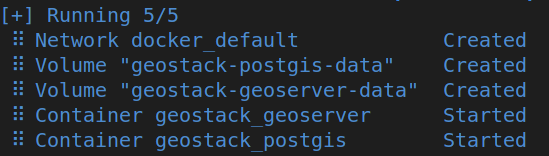
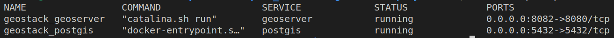

# Déploiement de GeoStack avec docker compose

Illustration de l'utilisation de docker compose pour démarrer une stack applicative à partir d'un fichier [docker-compose.yml](docker-compose.yml).

## Utilisation

* Démarrer la stack :

```bash
# export POSTGRES_PASSWORD=MotDePasse
docker compose up -d
```



* Vérifier que les services sont bien démarrés : `docker compose ps`




* Accéder à GeoServer sur le port 8082 :
  * http://localhost:8082/geoserver
  * http://devbox.ign.fr:8082/geoserver/

## Remarque

On s'appuie sur :

* L'image officielle [postgis/postgis](https://hub.docker.com/r/postgis/postgis) pour le déploiement PostgreSQL
* L'image [mborne/docker-geoserver](https://github.com/mborne/docker-geoserver#readme) construite avec GitHub actions.


